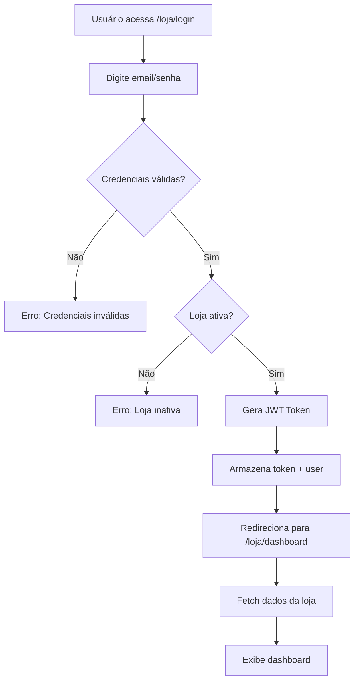

# Sistema de Login de Lojas - RELM Care+

**Data de Criação**: 2024-02-24  
**Status**: ✅ Implementado

## 📋 Visão Geral

O Sistema de Login de Lojas permite que lojas parceiras acessem um portal exclusivo onde podem gerenciar seus clientes, garantias e seguros vinculados à sua loja.

## 🗂️ Estrutura do Sistema

### 1. Database (PostgreSQL)

**Tabela: `store_users`**
```sql
CREATE TABLE store_users (
    id UUID PRIMARY KEY DEFAULT gen_random_uuid(),
    store_id UUID NOT NULL REFERENCES stores(id),
    email VARCHAR(255) UNIQUE NOT NULL,
    password_hash VARCHAR(255) NOT NULL,
    name VARCHAR(255) NOT NULL,
    role VARCHAR(50) DEFAULT 'STORE_ADMIN',
    is_active BOOLEAN DEFAULT true,
    created_at TIMESTAMP DEFAULT NOW(),
    updated_at TIMESTAMP DEFAULT NOW()
);

-- Indexes
CREATE INDEX idx_store_users_store_id ON store_users(store_id);
CREATE INDEX idx_store_users_email ON store_users(email);
```

**Modelo Prisma:**
```prisma
model StoreUser {
  id           String   @id @default(uuid())
  storeId      String   @map("store_id")
  email        String   @unique
  passwordHash String   @map("password_hash")
  name         String
  role         String   @default("STORE_ADMIN")
  isActive     Boolean  @default(true) @map("is_active")
  
  createdAt    DateTime @default(now()) @map("created_at")
  updatedAt    DateTime @updatedAt @map("updated_at")
  
  store Store @relation(fields: [storeId], references: [id])
  
  @@index([storeId])
  @@index([email])
  @@map("store_users")
}
```

### 2. Backend (NestJS)

#### Arquitetura de Módulo

```
backend/src/store-auth/
├── dto/
│   ├── store-login.dto.ts
│   └── create-store-user.dto.ts
├── store-auth.controller.ts
├── store-auth.service.ts
├── store-auth.module.ts
└── store.guard.ts
```

#### Endpoints da API

| Método | Rota | Descrição | Autenticação |
|--------|------|-----------|--------------|
| `POST` | `/api/store-auth/login` | Login de loja | Público |
| `POST` | `/api/store-auth/register` | Criar usuário de loja | Admin |
| `GET` | `/api/store-auth/users` | Listar usuários da loja | JWT |

#### DTOs

**StoreLoginDto:**
```typescript
{
  email: string;      // Email válido
  password: string;   // Mínimo 6 caracteres
}
```

**CreateStoreUserDto:**
```typescript
{
  storeId: string;    // UUID da loja
  email: string;      // Email válido
  password: string;   // Mínimo 6 caracteres
  name: string;       // Mínimo 3 caracteres
}
```

#### Resposta de Login

```typescript
{
  access_token: string;
  user: {
    id: string;
    name: string;
    email: string;
    role: string;
    type: 'STORE';
    storeId: string;
    store: {
      id: string;
      tradeName: string;
      city: string;
      state: string;
    };
  };
}
```

### 3. Frontend (React)

#### Componentes Criados

```
frontend/src/pages/
├── StoreLoginPage.jsx    (4.2 KB)
└── StoreDashboard.jsx    (6.8 KB)
```

#### Rotas

| Rota | Componente | Descrição |
|------|-----------|-----------|
| `/loja/login` | `StoreLoginPage` | Página de login da loja |
| `/loja/dashboard` | `StoreDashboard` | Dashboard da loja |

#### API Service

**storeAuthAPI** adicionado em `services/api.js`:
```javascript
export const storeAuthAPI = {
  login: (email, password) => api.post('/store-auth/login', { email, password }),
  register: (data) => api.post('/store-auth/register', data),
  getUsers: () => api.get('/store-auth/users').then((res) => res.data),
};
```

## 🚀 Como Usar

### 1. Criar Usuário de Loja (Admin)

```bash
# Via API (requer token de admin)
curl -X POST http://localhost:3005/api/store-auth/register \
  -H "Authorization: Bearer YOUR_ADMIN_TOKEN" \
  -H "Content-Type: application/json" \
  -d '{
    "storeId": "uuid-da-loja",
    "email": "gerente@loja.com",
    "password": "senha123",
    "name": "João Gerente"
  }'
```

### 2. Login de Loja

1. Acesse: `http://localhost:5173/loja/login`
2. Digite email e senha
3. Será redirecionado para `/loja/dashboard`

### 3. Dashboard da Loja

O dashboard exibe:
- **Estatísticas**: Total de clientes, garantias e seguros
- **Ações Rápidas**: Novo cliente, ver garantias, ver seguros, produtos
- **Atividade Recente**: Últimas garantias registradas

#### Filtros por Loja

Os dados são automaticamente filtrados pelo `storeId` do usuário logado:
- Clientes vinculados à loja
- Garantias da loja
- Seguros da loja

## 🔒 Segurança

### Autenticação

- Senhas hasheadas com **bcrypt** (salt rounds: 10)
- JWT tokens para sessões
- Tokens armazenados em `localStorage`

### Autorização

- **StoreGuard**: Protege rotas que requerem acesso de loja
- Verifica tipo de usuário: `STORE` ou `ADMIN_RELM`
- Cada loja só acessa seus próprios dados

### Validações

- Email único por usuário
- Senha mínima: 6 caracteres
- Verificação de loja ativa
- Verificação de usuário ativo

## 📊 Níveis de Permissão

### Admin RELM
- ✅ Criar usuários de loja
- ✅ Acessar todos os dados
- ✅ Gerenciar todas as lojas

### Usuário de Loja (STORE)
- ✅ Ver clientes da sua loja
- ✅ Ver garantias da sua loja
- ✅ Ver seguros da sua loja
- ✅ Ver produtos da sua loja
- ❌ Não acessa dados de outras lojas
- ❌ Não acessa área de admin

## 🔄 Fluxo de Autenticação



## 📦 Deployment

### 1. Aplicar Migração

```bash
cd backend
npx prisma migrate dev --name add_store_users
npx prisma generate
```

### 2. Verificar Backend

```bash
# Verificar módulo carregado
ls -la backend/src/store-auth/

# Testar endpoint
curl -X POST http://localhost:3005/api/store-auth/login \
  -H "Content-Type: application/json" \
  -d '{"email":"test@loja.com","password":"senha123"}'
```

### 3. Verificar Frontend

```bash
# Build frontend
cd frontend
npm run build

# Deploy dist/
```

## 🧪 Testes

### Teste Manual

1. **Criar Store User** (via Postman/curl com token admin)
2. **Login**: Acessar `/loja/login`
3. **Dashboard**: Verificar se redireciona corretamente
4. **Dados**: Confirmar que mostra apenas dados da loja

### Checklist de Validação

- [ ] Tabela `store_users` criada
- [ ] Endpoint `/api/store-auth/login` funcionando
- [ ] Endpoint `/api/store-auth/register` funcionando (admin)
- [ ] Login de loja redireciona para dashboard
- [ ] Dashboard exibe dados filtrados por loja
- [ ] Logout funciona corretamente
- [ ] Senhas hasheadas no banco
- [ ] JWT token válido

## 📝 Próximos Passos

### Semana 1 (Atual)
- [x] Criar tabela `store_users`
- [x] Implementar StoreAuthService
- [x] Implementar StoreAuthController
- [x] Criar StoreLoginPage
- [x] Criar StoreDashboard
- [x] Adicionar rotas no App.jsx
- [ ] Testar fluxo completo
- [ ] Criar primeiro usuário de loja

### Semana 2-3 (Próximo)
- [ ] Adicionar filtros por `storeId` em:
  - [ ] CustomersModule
  - [ ] WarrantyModule
  - [ ] InsuranceModule
- [ ] Criar páginas específicas da loja:
  - [ ] `/loja/clientes`
  - [ ] `/loja/garantias`
  - [ ] `/loja/seguros`
  - [ ] `/loja/produtos`

### Semana 4 (Futuro)
- [ ] Portal do Cliente
- [ ] Galeria de Fotos
- [ ] Clube de Vantagens

## 🐛 Troubleshooting

### Problema: "Cannot find module '@prisma/client'"
```bash
cd backend
npm install
npx prisma generate
```

### Problema: "Email já cadastrado"
- Verificar se email existe na tabela `store_users`
- Usar email diferente ou remover registro existente

### Problema: Login não redireciona
- Verificar console do navegador
- Confirmar que token está sendo salvo no localStorage
- Verificar formato da resposta da API

## 📞 Contato

Para dúvidas ou suporte:
- Abra uma issue no repositório
- Entre em contato com a equipe de desenvolvimento

---

**Última Atualização**: 2024-02-24  
**Versão**: 1.0.0
